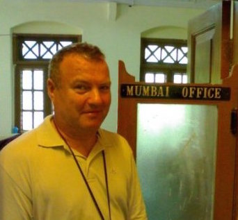

<link href="./css/xxx.css" rel="stylesheet"></link>

###Indholdsfortegnelse
- [Forord](#Forord)
- [Indledning](#Indledning)
- [Sachsenhausen historisk](#Sachsenhausen)
- [Arresteret](#Arresteret)
- [I Koncentrationslejr](#Koncentrationslejr)
- [Ankomsten](#Ankomsten)
- [Barak Nr. 14](#Barak14)
- [Arresteret](#Arresteret)
- [På Klinker](#Klinker)
- [Afstraffelse](#Afstraffelse)
- [Paa Sygehuset](#Sygehuset)
- [Sygebesøg](#Sygebesøg)
- [Befrielsen](#Befrielsen)
- [Hitlers Fødselsdag](#Fødselsdag)
- [Hjemturen](#Hjemturen)
- [Hjemme](#Hjemme)
- [Eter krigen](#Efter)
- [Ordliste](#Ordliste)

#I Koncentrationslejr

  

[Sachsenhausen](https://www.google.dk/maps/place/Memorial+and+Museum+Sachsenhausen/@52.7670842,13.2602867,17z/data=!3m1!4b1!4m2!3m1!1s0x47a84e171929e405:0xceeb9dedb3523122?hl=en)

[wiki](https://en.wikipedia.org/wiki/Sachsenhausen_concentration_camp)

###Forord

Tak til

Poul Nielsen, Jan Schjønning og Rune Schjønning - uden jeres hjælp var bogen ikke blevet til.


###Indledning




Den 23. november 1943 blev 31 danskere deporteret til Tyskland. Transporten var blandt de første officielle samlede transporter af danskere til koncentrationslejre i Det Tredje Rige, og skete som følge af de voldsomme augustdage, hvor danske arbejdere og arbejdsgivere gik på gaderne og demonstrerede mod den danske regerings samarbejdspolitik med den tyske besættelsesmagt. De 31 odenseanere ombord på transporten var alle mellem 17 og 28, og blev deporteret uden dom. De fleste var kommunister, men også upolitiske unge, der havde været med til at omdele ulovlige blade eller mangfoldiggøre illegale billeder, blev arresteret, udsat for hårdhændede forhør og endeligt sendt til koncentrationslejren Sachsenhausen, hvor 17 måneders rædsler ventede dem.
Blandt de 31 odenseanere var Poul Nielsen og Vagn Schjønning, begge kun 18 år gamle. Poul var i lære som medhjælper i boghandelen Hempel, hvorfra han under desken solgte forbudt litteratur. Vagn arbejdede som pressefotografelev på Fyens Stiftstidende, og i fritiden tog han illegale billeder, og fremkaldte dem i et hjemmelavet mørkekammer i forældrenes hus. De to kendte ikke hinanden, men det kom de til, da de for en tid måtte dele køje i lejren og senere kunne dele de oplevelser med hinanden, som ingen andre nogensinde rigtigt vil forstå.


6 år efter besøgte de to kammerater sammen området igen, og genså det, der nu kun var ruiner af den tidligere fangelejr. Her tog de billeder af hovedlejren Sachsenhausen, som senere er genopført som museum, og af udekommandoen Klinker, som ikke længere eksisterer. Billederne er nogle af de eneste, der findes derfra.
Poul og Vagn har begge levet længe nok til at viderefortælle deres historie; Vagn skrev sin ned i ’45, da han kom ind på Sømandshøjskolen i Svendborg og udgav den i skolens elevblad, og Poul rejser den dag i dag stadig rundt og holder foredrag om lejren og de ting, han var vidne til. 
I 2009 døde Vagn og efterlod sig en hel mappe med billeder, breve, skriverier og minder fra de halvandet år i fangenskab. Sammen med Pouls fortællinger danner de rammen for denne bog, som er en rejse gennem tid på flere måder.  Brevene, trods censuren,  giver indblik i en ung mands tanker mens han sad i lejren, og artiklen fra ’45 fortæller om Vagns oplevelser i lejren som han så dem, få måneder efter sin hjemkomst. Poul er blandt de sidste levende vidner fra lejrene, og hans fortælling indeholder erfaringer og historiske perspektiver fra efter krigen og indtil i dag. 
Fortællingerne har hver deres form – mens Vagns er nedskrevet og i dag kun findes på papir, er Pouls fortælling en mundtlig overlevering, hvis hovedtræk findes i skriftlig form i denne bog, og suppleres med videoklip. Selvom de to deler en galgenhumoristisk tilgang til deres oplevelser, hersker der ingen tvivl om alvoren bag deres ord. Deres fortællinger er her forsøgt gengivet så nøjagtigt som muligt med et håb om, at det kan give læseren en fornemmelse af, at høre historien genfortalt fra to, der var der selv. 

###Sachsenhausen Historisk

VAGN SCHJØNNING     ODENSE, 2001

Allerede i 1933 efter Hitlers overtagelse af magten, lod SA oprette ca. 50 koncentrationslejre, heraf en i et tidligere Schultheiss bryggeri i Oranienborg. I 1934 blev SA’s KZ-lejre opløst i marts, som de eneste blev Dachau og Oraniensborg bevaret, men nu i SS-regi. Oranienborglejren viste sig hurtigt at være for lille, og det blev besluttet at lukke denne bl.a. for at slette navnet Orianienborg, der i mellemtiden var blevet berygtet i udlandet, idet det var lykkedes to tidligere socialdemokratiske regeringsmedlemmer at flygte til udlandet, og her berette om hvad der foregik i lejren. I stedet  besluttede man at åbne en ny lejr i nærheden af Oranienborg, i området Sachsenhausen.

I efteråret 1936 ankom de første fanger fra Moorlager Esterwegen for at begynde opførelsen af den nye lejr. Først blev der dog bygget kaserne til SS, og inden fangebarakkerne var opført, måtte fangerne overnatte i fri luft.
Sachsenhausen var ved oprettelsen beregnet som en af tre hovedlejre: Dachau skulle dække sydtyskland, Buchenwalde midttyskland, og Sachsenhausen Nordtyskland. I begyndelsen lå ledelsen af alle KZ-lejre i Berlin under Heydrich’s kommando. Senere efter bygningerne var færdige, flyttedes administrationen af alle KZ-lejre til Sachsenhausen under ledelse af SS General Pohl. Grunden hertil var den centrale beliggenhed ved Berlin, der var hovedleverandør af mennesker fra herværende fængsler. Den første kommandant i Sachsenhausen var Baranowski, som begyndte med at oplyse: ”Her må ingen le, den eneste der ler her er djævlen, og djævlen er mig.”
I de første år fandtes der intet krematorium i lejren, først i 1939 modtog lejren fire transpotable ovne. Disse ovne kom samtidig med at de første transporter af udenlandske fanger ankom til lejren, hovedsagelig studenter, lærere, professorer – så at sige hele den åndelige elite fra Chekoslovakiet. 1100 studenter fra Prag som kom i nattøj, ja nogle barfodet. Mange af dem overlevede ikke den første vinter. På samme måde blev den polske intelligens sendt til Sachsenhausen, hvor de blev umenneskeligt behandlet. Bl.a. lod man 33 af dem træde an ved porten, gav dem ordre til at trække af tøjet – dernæst skrev SS’erne deres fangenummer i panden, hvorpå de blev myrdet. 
I januar 1940 var fangebestanden 8300. Ved årsskiftet havde man passeret fangenummer 24.000, hvoraf altså 8300 endnu var i live.
Krigen mod Sovjet begyndte i juni 1941, og sidst i august kom de første krigsfanger til Sachsenhausen, hvorved Genevekonventionen blev groft overtrådt. De blev anbragt i isolering, hvor de hverken fik strå eller tæpper, og måtte sove på gulvet. Forplejningen var yderst mangelfuld, og en morgen manglede 15 af de i nattens løb døde, kød fra lemmerne. Dødeligheden var stor, og hver morgen lå mindst 30 døde foran barakkerne. Krematoriet kørte i døgndrift.
Hensigten med at føre krigsfangerne til Sachsenhausen var at likvidere dem, og da de gik for langsomt at sulte dem ihjel, blev der bygget et likvideringsanlæg i Industrihof. Det blev indrettet som en badeanstalt, hvor fangerne først skulle klæde sig af og dernæst enkeltvis kom ind i et undersøgelsesrum, hvor der var et skjult skydeskår i en forskydelig vinkel på en målestok, der skulle give indtryk af at man ville måle personens højde.
Den 2. september begyndte den første ’Sonderaktion’ idet 500 krigsfanger blev henrettet. Aktionen fortsatte, og i januar 1942 fik man ordre til at bygge en bedre henrettelsesstation, der blev døbt Station Z.
Da aktionen blev erklæret ’vorläufig beendigt’ havde man myrdet ca. 18.000 russere. I juli ankom de første franskmænd til lejren. Den 30. august inspicerede Himmler sammen med Franco-offficerer Industrihof og Station Z., og da der sidst på året opstod brand i Blok 13, stod hele lejren til strafappel i 22 graders kulde, og et ukendt antal fanger frøs ihjel.
Efter ordre fra politisk afdeling blev samtlige jødiske grafikere, urmagere, optikere og juvelerer isoleret i Blok 18, og her indrettedes et falskmøntnerværksted. I løbet af 1942 bedredes forholdene i lejren, idet der opstod mangel på arbejdskraft i krigsindustrien, og her fandt man fangerne velegnet. Samtidig forværredes fødevareforsyningen, og sulten krævede mange ofre.
I oktober ankom de første ni nordmænd, hvoraf kun én overlevede. I løbet af 1942 tog transporten af nordmænd fart, men af de første 250, døde halvdelen på et år. Af kendte nordmænd i lejren kan nævnes Einar Gerhardsen, socialminister Svend Oftedal og forfatteren Arnulf Øverland.
Den 2. august blev 96 hollændere likvideret i Station Z. Efter attentatet på Heydrich myrdes 500 jøder. I oktober udbygges Station Z med et gaskammer.

I marts var fangebestanden på ca. 16.000, men de fortløbende fangenumre havde passeret 41.000. I 1943 udførtes en lang række medicinske forsøg i Sachsenhausen, bl.a. blev 11 jødiske børn inficeret med gulsot, den yngste var 7 år. Der blev også udført operationer på fanger, der var påført infektionssyge. Forsøg med forskellige kampgifte fortsatte helt til 1945, hovedsagelig med russere som ofre.
Den 25. november kom de første 31 danskere til lejren, og den. 19. december yderligere 58, men flere fulgte i løbet af 1944, og det højeste antal danskere i lejren var ca. 260. Året 1944 blev især kendetegnet med attentatet på Hitler den. 20. juli, der medførte at mange kendte personer blev sendt til Sachsenhausen, og mange af de formodede attentatdeltagere henrettet. Samtidig blev der foretaget razzia i lejren, og mange der blev mistænkt for oprørsplaner blev ligeledes henrettet – især mange af de kommunister, der havde siddet i lejren siden oprettelsen. 
Ved årsskiftet 1944-45 var der ca. 2000 nordmænd, 1500 czeker, 2500 hollændere, 700 belgiere, 4800 franskmænd, 67 spaniere, 12.000 polakker, 275 grækere, 14 englændere, 215 italienere, 218 danskere, ca. 10.000 russere og ca. 5000 tyskere.

Mere orker jeg ikke at skrive...

###Arresteret

POUL NIELSEN     ODENSE, MAJ 2014


Jeg var jo ikke frihedskæmper, det har jeg heldigvis aldrig prøvet på at give udseende af. Det ville være kedeligt at blive afsløret i sådan nogle løgnehistorier bagefter. 
		Jeg var 17-18 år, og ude fra Bernsdorfsvej. Det var jo en spændende tid, der var pludselig noget larm der, og nogle de gemmer sig, og andre de går hen og ser hvad det er for noget, ikke? Nogle af dem jeg mødte, de gik rundt med sådan en mappe, og en sagde: ”Hej, kom lige her hen… Jeg skal have det her delt ud, nogle af de her blade her, kan du ikke lige hjælpe mig med det? For jeg har så mange.” ”Jo, hvor skal du have dem hen?” ”Jamen, hvis du tager Munkebjergvej derovre…” Det skulle jeg nok, så fik jeg sådan en stak blade, og så delte jeg dem rundt. Og fotografier. Jeg tog selvfølgelig, hvis jeg så noget med nogle tyskere eller noget, så tog jeg nogle billeder. Ikke ret meget af den slags, men jeg fik fat i en hel del illegale billeder, og dem affotograferede jeg, og så lavede jeg kopier, og så kunne jeg udbrede dem og fordele dem. Også illegale bøger - der iblandt den der lå ved min seng, da Gestapo kom om morgenen og sagde: ”Aha! Der licht das book!”. Det var så den, jeg havde været med til at udbrede lørdag eftermiddag, da jeg blev vækket søndag morgen – tidligt.
Og så var det jeg blev inviteret på køretur til Gestapo-hovedkvarteret. Jeg tog det hele ovenfra, jeg var ikke bange eller noget – jeg syntes det var meget spændende, og glædede mig til at fortælle mine kammerater om det. På vej derud kørte vi venstre om en helle et eller andet sted, og jeg sagde: ”I Danmark kører man højre om hellerne.” Han kiggede på mig som om jeg ikke var rigtigt klog – det var jeg heller ikke, at jeg kunne sige sådan noget åndssvagt til en Gestapomand. Så kom vi ud til forhør på Husmandsskolen i det nyoprettede Gestapo-hovedkvarter, de var ved at indrette det stadigvæk. Så da han pegede på mig med pistolen, sagde jeg: ”Hvis I skyder mig kan jeg jo ikke sige noget.” ”De har et arrogant og utiltalende væsen, Hr. Nielsen!” sagde han, og det var jeg jo meget stolt over. Men efterhånden så gik det der af mig. Når du fik tæsk osv. så forsvandt det, alt det der. Så blev det alvor. Man kom tilbage til den reelle verden.

###I Koncentrationslejr

<tt style="font-size:12pt">

Det begyndte en fredelig Efteraarsaften i 1943. Jeg stod hjemme og tog Afsked med en Kammerat, da det ringede paa Døren, og jeg gik ud for at lukke op. Udenfor stod en Pige, som vilde tale med mig. Jeg slog et Grin op og sagde: ”Væersaagod,” men hun vilde have, at jeg skulde komme ud til hende. 
	 Jeg rødmede og traadte ud. Saa snart jeg var kommet ud paa Trappeopgangen, lød der Hyl og vilde Brøl baade ovenfra og nedefra, og en revolverbevæbnet Mandsperson kom på bedste Wild-West-Manér styrtende ned oppe fra, medens to ligesaa gæve Krigere kom nede fra. De svingede Kanonerne og præsenterede sig som Gestapoer. De sagde til mig, at jeg skulde gaa ind i stuen igen, hvorefter den ene løb i Forvejen derind. Efter Larmen at dømme kunde jeg vente at finde ham gyngende i Lysekronen, saa galt var det nu ikke, han indskrænkede sig til at skille Skrivebordet ad. 
	 Efterhaanden fik de to andre samlet Lejlighedens Beboere, og vi blev stillet op i et Hjørne alle 4 (min Kammerat, mine Forældre og jeg) med Hænderne i Stilling stil Morgengymnastik. Min Far udtrykte Haabet om, at de vilde more sig godt, og indledte dermed den bedste Juleleg, jeg har set. De var meget smidige, mere end man skulde tro efter deres Omfang. Den ene kunde paa 2 Minutter og 12 Sekunder kravle bag om 2 Lænestole, under en Sofa og over Klaveret. 
		De andre stod heller ikke tilbage. En var efter Larmen at dømme meget begejstret for Køkkenet, han bar da ogsaa tydelige Spor af Marmelade i Mundvigende og paa Fingrene, da han kom tilbage. Det gik hurtigt op for os, at de søgte noget, de gjorde det grundigt, og i Løbet af en halv Time fandt de en utrolig Masse Billeder samt Kraveknapper, som min Fader i Tidens Løb havde tabt, endvidere Naale og deslige, som Mor havde tabt. Ja, en hel Masse Smaating, som vi for længst havde glemt og som vi troede fortabt.

Billederne kunde de ikke lide, de mente, de var skadelige og kunde fordærve Folk, og inviterede min Kammerat, der tilfældigvis ogsaa havde et par Billeder paa sig, og mig ud paa Husmandsskolen i Odense, for som de sagde, at vise os, hvordan Billederne skulde tages. Vi blev rørt over deres venlighed og nænnede ikke at afslaa. 
Vi ankom dertil i god Orden. Jeg kom op paa 1.Sal, og her havde vi en højest livlig Underholdning i 8 Timer, saa fik jeg anvist et Værelse uden Vinduer og 1,5 m til Loftet med den Bemærkning, at som Fotograf maatte et Mørkekammer vel passe mig bedst. Et Par Timer  efter begyndte Underholdningen igen, for ellers blev det jo noget kedeligt for Herrerne. 

5 Dage senere skulde vi saa ud paa en Køretur, vi var nu blevet 12 Personer. Vi blev glade som Børn og vinkede med Taarer i Øjnene Farvel til vore Legeonkler. Turen gik pr. Lastbil til København, hvor vi tog Logi for Natten paa Vestre Fængsel. 
Næste Morgen var der Kludder med Portieren, og vi blev enige om at se Tiden an og Vente. Det var i øvrigt det ideelle Rekreationshjem, man førte et roligt og regelmæssigt Liv. Vi stod op Kl. 6, fik en Tallerken god, nærende Vand, Kl.10 kom Piccoloen og spurgte, om man ikke vilde gaa en Tur, og han blev ved at presse, til man gik med. Saa kom vi ned i hver sin Gaard i 20 minutter, og for at man ikke skulde kede sig, var der i Midten med Udsigt til alle Gaardene anbragt en levende Sprællemand, der kunde en Masse sjove Ord. Ved Tolvtiden kom Kokken personlig for at overrække os et Maaltid. Han var altid spøgefuld, det kære Menneske, men mig har han kun ramt en enkelt gang med Kartoflerne. Ved Sekstiden fik man Smørrebrød serveret, og Kl. 9 Aften kom den vagthavende og kyssede os Godnat. 
Om Natten var Vagten meget bekymret for os, han kom flere Gange og tændte Lyset for at se, om vi sov godt. Naa, man skal holde op, mens Legen er god, og en Uge senere sagde vi op og rejste til Horserød, der var berømt som et godt Madsted, hvilket det i Virkeligheden ogsaa var. Her blev vi udnævnt til Gartnere og Stenhuggere. Vi flyttede samtlige Græsplæner mindst 4 gange om Ugen i løbet af den Maaned, vi var der. Det var det første Møde vi havde med Organisationen ”Knold og Tot”.
En Dag kom der Besked om, at vor kære Ven, Frikorpsmanden Thor Nielsen, var blevet skudt, han havde deltaget i Forhørene paa os, og vi sørgede i to Dage og Nætter med Gravøl og hvad sig dertil hører. Paa Andendagen mente Kommandanten at en Tur til København vilde gøre os godt, og vi blev hurtigt enige. Paa Alsgades Skole mødte vi 19 andre Odenseanere, der endnu bar Spor af Julelegene. Her fik vi at vide, at man havde en Overraskelse til os, hvis vi vilde være nogle gode Drenge. 
Vi kom med et Tog, og efter 12 Timers Kørsel og 2 Timers Sejlads befandt vi os i Warnemünde. Stemningen blev nu lidt mattere, og der blev ikke talt ret meget; vi forsøgte at synge, men det gik heller ikke. Vore Vagtposter var mærkværdigt flinke, og naar vi havde et Ønske, forsøgte de paa alle Maader at opfylde det. De vidste jo, hvad der ventede os, og det gjorde ikke vort Humør bedre. Hele Dagen stod Toget i Warnemünde, men saasnart det blev mørkt, kørte vi, og Kl. 4 1/2 holdt vi ved en Station 30 km fra Berlin. Vi styrtede ud for at se, hvad den hed – Sachsenhausen – av, det var jo der, han, der havde skrevet en Bog, havde siddet, og Modet dalede yderligere. 

Regnen silede ned, vi blev gennemblødte, og pludselig forandrede vore Vagter Tonen. De raabte og skreg, sparkede og slog med Geværerne. Vi maate marchere 2-3 km, og hele Tiden saa vi Projektører, der strøg hen over Pigtraad og elektriske Gitter og hørte Vagternes Brøl fra det ene Vagttaarn til det andet.
Uden at vi havde bemærket det, var vor Flok nu forøget med 6 Mand, men da vi efter megen Parlamenteren mellem vore og Lejrens Vagtposter kom ind i selve Lejren, saa vi dem og fik at vide, at det var danske Jøder. 
Havde Tonen været ublid før, saa var den helt hysterisk nu. Saa snart vi havde passeret den sidste Gitterdør ind til Lejren fór SS-Mænd rundt imellem os og udsøgte sig de bedste Ofre, og de valgte med særlig Forkærlighed Jøderne. En blev behandlet særligt hårdt, han var sindssyg ved Ankomsten. Og bedre blev det ikke. De smed ham omkuld i en Mudderpøl, trampede på ham og sparkede til ham, indtil de var kede af det. Nu var der ikke for 5 Øre Mod tilbage i os. Vi stod alle 37 gennemblødte, blegnæbbede og stirrede fortabt paa, hvad der hændte rundt om os.

Pludselig ringede en Klokke, og fra 3 Verdenshjørner kom nogle underlige Skikkelser trampende hen imod os. Vi spærrede Øjnene op – skaldede – magre – stribet Tøj eller Kryds paa Ryggen, et stort nummer på brystet, og stort mere lystige end os saa de ikke ud. Der kom flere og flere, og et Stykke fra os gjorde de holdt. Efterhaanden stod der 10-12.000 bag ved os. De blev talt i Løbet af en halv Time, og derefter lød der et mægtigt Klask. Vi fór sammen og vendte os om – var der blevet skudt eller hvad? Nej, de havde bare taget Huen af alle på én Gang. 
Det var baade første og sidste gang, vi hørte de så taktfast. Næste Gang var vi selv med, og siden var der altid en, der kom et par sekunder bagefter, naar han stod og drømte om en herlig dansk Bøf. 

Efter denne Parade tømtes Pladsen – de marcherede til Arbejdet, og vi kom til Aflusning. Her gennemgik vi en forvandling, hver Trævl blev taget fra os, og kun Livremmen maatte vi beholde. Al Haaret blev klippet af, og til sidst fik vi udleveret et Sæt Fangetøj. Under Klipningen kom noget af Humøret igen, og da vi saa hinanden i Fangetøj, hylede vi af latter. Størst var Jubelen over de Træsko, vi fik, det var rigtige Nissetræsko. Om Fødderne fik vi nogle Klude, som de kaldte Füslinge, Bukserne naaede i bedste Fald et Stykke ned over Knæene. Under stor Jubel marcherede vi saa hen i den Barak, hvor vi foreløbig skulde bo.		

		
</tt>

		


###Ankomsten
	
POUL NIELSEN     ODENSE, MAJ 2014
	
Vi blev overtaget af de her maskinpistolbevæbnede vagter, og det var så under kommandoer og dårligt tysk. Vi var stadig ikke mere end de her 36 mand, men i kolonner af 5-mands gelleder, og så havde vi jo stadigvæk de her papkasser – OMA-kasser, som vi havde fået udleveret på Alsgades Skole. Tyskerne havde givet os proviant med til turen. Det sjaskhammeregnede, da vi kom fra Sachsenhausen station, og det vil sige at nogle af de her papkasser de blev gennemblødte og gik i stykker. Indholdet det faldt ud af dem – så der har nok været nogle tyskere, der er blevet glade for nogle af de gode fødevarer, som var med fra Danmark. 

Men vi gik de her – jeg ved ikke om det var en kilometer fra stationen, det kan man selvfølgelig måle efter, og kom så uden om lejren og ind til hovedbygningen ved ”Turm A” – Tårn A, som var med stue, første og anden sal. På anden sal, der var lavet sådan en udbygning på hovedbygningen, og der var placeret et tungt maskingevær, som kunne skyde ud i hele lejrområdet idet den stod i centrum af en halvcirkel. Barakkerne var så lagt som stråler ind imod centrum – dvs. man kunne skyde ind imellem alle mellemrummene mellem barakkerne, og alle barakkerne havde så gavlen vendt imod centrum. Der kom vi igennem port A, ”Arbeit Macht Frei”, og blev kommanderet til højre, og skulle så stå og glo direkte ind i pigtråden, dvs. med ryggen mod selve lejren. 
Da vi havde stået ganske kort tid, forsvandt de vagter, som havde hentet, og så kom der i stedet  nogle af de der lokale ”blokführe” – dvs. de SS-folk ”scharführer” og ”oberscharführer”, som havde ansvaret for en blok, eller måske nogle gange to blokke, og for at der var den orden, der skulle være ifølge reglementet. De havde ansvaret for at antallet af fanger det stemte. De kom hen til os, og en af dem spurgte: ”Wo seid in her?” – hvor kommer I fra? ”Wir sind Dänen,” har Vagn nok sagt sammen med mig, for der var ikke ret mange af os, der kunne tysk. ”Ah, danskere, Speck-Dänen”, altså flæskedanskere, som de yndede at kalde os, for de fik jo mange af deres levnedsmidler fra Danmark. Og da de sådan havde stået og kigget lidt på os, skubbet og sparket, men ikke noget særligt, så lød det: ”Wenn es keine Juden hier?” – Er der nogen jøder her? Og der var 5 jøder med, men der var jo ikke nogen af dem der trådte frem og råbte ”Juhu, jeg er jøde,” – de var godt klar over det ikke var særligt populært. De så rundt på de forskellige, og der var så én imellem, han lignede virkelig en karikatur på en jøde; han var foroverbøjet, store ører til et rundt hoved, og næsen var også med – han lignede virkelig en karikatur. Og ham faldt de over selvfølgelig, og begyndte at slå og sparke. Han faldt om og jamrede, men så heldigvis lød signalet, der kaldte til appel, og det betød at de forskellige blokføreres fanger kom marcherende frem under kommando af den øverste fange fra hver blok – blokældesten. Så måtte blokførerne hen og sørge for at antallet stemte i de forskellige blokke. 

Når det var i orden, stod de i retstilling foran dem, de havde kommandoen over, og så kom blokføreren hen og fik meldingen fra de forskellige blokældeste; Så og så mange fanger, så og så mange døde, og eventuelt om der var nogen til reviret – altså til infirmeriet. Og eventuelt døde, som var døde efter alarmen aftenen før, de var blevet stablet op for enden af barakkerne, og skulle så tælles med der ved morgenappellen, så antallet stemte. Og så kunne de så derfra blive kørt over til krematoriet.

Et stykke tid efter vi hørte alle disse mærkelige kommandoråb kunne vi skele til højre, hvor vi var kommet ind – der kunne vi se kolonnerne rykke ud; de skulle på arbejde. Da de sidste var rykket ud, der var vel en 25.000 ca., så skulle vi over og have vores fangenummer, og registreres. 
Da kom vi over på det, der hed ’schreibstube’ - kontoret eller hvad man nu vil kalde det. Da vi var kommet indenfor lød det pludselig: ”Hei, velkommen Danskere” – det var så en nordmand, som var øverste fange i den der schreibstube, og han sagde at det var rart at se nogle danskere, ”der er jo ikke andet end nordmænd her.” ”Nu kommer vores brødre fra Danmark også. Nu skal I se, det går alt sammen,” og hvad han nu kunne sige til os. ”Nu skal I lige have jer et bad, så får I noget ordentligt tøj i stedet for det I kommer med,” og det var da udemærket. 
Så kom vi i bad, og da det var sket, blev vi kommanderet hen på et par lange bænke, der var stillet i forlængelse af hinanden, og ned og sidde på den, og pludselig mærkede vi en hånd bagved, der tog fat i vores hår, og så kom der én med en håndklipper, og så røg lokkerne. Da hovedet var ordnet, så skulle resten af kroppen også være hårfri, og da det var overstået, kom der en med en blæsebælg man bruger til en pejs, der var bare hvidt lussepulver i, i stedet for. Og så blev vi sprøjtet både foroven og forneden, for at være sikker på, der ikke var nogen lus, når vi kom ind i lejren. ”Ein laus, dein toot” – ”En lus, din død,” var der store plakater med, og dødningehoveder på. Årsagen var, at der tidligere havde været et tyfus-epidemi, og det gjorde jo ikke så meget at fangerne døde, men det var så udbredt, at det også gik ud over fangevogterne, og på det grundlag, så kunne man altså ikke have, at der var tyfus, så derfor blev renlighed ført i højsædet – ingen lus i hvert fald. Og renlighed, det er jo selvfølgelig godt nok. Men det var en mærkelig måde de praktiserede den på.

Da vi nu var blevet renset for både det ene og det andet, så skulle vi have udleveret noget andet, i stedet for det tøj, vi måtte aflevere. Og det foregik ved at, der var en slags desk - det lyder så fornemt, ment i hvert fald et bredt stykke bord - og der bagved, der var nogle fanger, og de så på den pågældende, der stod foran, og så smed de et eller andet tøj hen til ham, og det kunne han så få. 
I nogle tilfælde var det ”den stribede habit”, som var lavet af en blanding af uld og træ – seluld. Det gav jo ikke ret meget varme, det gav måske nok nogle splinter, men det var det. Da der ikke var nok af det tøj heller, da vi var nået frem der i slutningen af ’43, så var man begyndt at bruge af det fangetøj fangerne havde haft på, og som var gemt, til senere udlevering. Det kunne man gøre ved på ryggen at indfælde et stort kors. Man kan forestille sig, at man lægger to arme over hinanden, og det store kryds, der er der, det var skåret ud af tøjet, og så var der sat en anden farve tøj i, i stedet for. Det var en tydelig markering. Og tilsvarende på benklæderne, da den ene side, der var en stribe med en anden farve tøj i. 

Fangenumrene, dem skulle vi også have. Foran nummeret var der en trekant, og i den trekant, der var et bogstav, som angav hvor fangen kom fra; B, belgier. F, franskmand. P, polak. Dansker, Dn – tyskerne havde ikke nogen, det var ikke nødvendigt. Det var sat inden i trekanten, og trekanten den var i forskellige farver, som angav hvilken kategori fangen var. Politiske fanger havde røde trekanter, forbrydere eller dem, de ikke kunne kategorisere – det kunne være folk, der var farlige som samfundet, de var måske ikke nazister, så de røg ikke ind som politiske, men ind ligesom forbryderne, og de fik så grønne trekanter. Så var der de lillafarvede for bibelforskere, dvs. jehovas vidner, og de var kommet ind bl.a. fordi de ikke ville være soldater, de ville ikke gøre militærtjeneste. Så de var en kategori for sig, og de blev specielt chikaneret - ligesom jøderne blev. De kunne blive løsladt, hvis de afsværgede deres tro, og meldte sig til militærtjeneste, men det var en meget lille procentdel, der gjorde det. Så var der sorte trekanter, det var ”arbejdssky elementer”, ”asociale”, som de blev kaldt – det kunne være bumser og forskellige de havde fundet af tyskere især, som altså ikke arbejdede. Og så var der endelig dem, der havde en rosa trekant, og farven angiver også hvad de var, altså homoseksuelle. Og dem lærte vi unge danskere hurtigt, at vi skulle passe på – nogle havde faderlige følelser, det var helt i orden, men det havde de andre ikke, de var ude på skrammer. 
På fødderne fik vi ikke nogle strømper eller noget – vi fik sådan en stor trekant. Den lagde man så på gulvet, satte foden på, og bøjede spidsen op, og bagefter de to hjørner, og lavede sådan en knude. Og det var udmærket – jeg vil sige til dem, som er trætte af at stoppe mandens sokker, de kan i hvert fald roligt gå over til de dér. Og så endelig så fik vi nogle store hollændertræsko, så vi var meget flotte , da vi drog derfra. Og det bevirkede jo også, hvad de ikke havde set før, at vi grinede af hinanden. Skaldede, og i noget mærkeligt tøj osv. Vi grinede simpelthen.
Og så var det vi kom over i ”isolirum” - karantænebarakken.



###Barak Nr. 14

VAGN SCHJØNNING     ODENSE,  AUGUST 1945



<tt style="font-size:12pt">

Vi kom til en Barak, der var afspærret fra de andre. Det var en Karantænebarak, og den havde Nr. 14. Vi kom under Støj og megen Ballade ind. Næppe var vi imidlertid kommet ind, før en lille skævøjet Fyr derinde eksploderede, saa man skulde tro, Hytten var ved at flække paa langs. Vi blev hurtigt jaget ud igen, men  vi havde ikke Lyst til at blive staaende alt for længe derude i vor Maskeradedragt. En af os, der forstod tysk, sagde, at han vist havde hentydet til vor Hovedbeklædning; den skulde af. Saa prøvede vi igen, og det gik bedre. Naa, da der var faldet Ro over Scenen, fik vi at vide, at vi skulde være her i 14 Dage for at lære Høflighed d.v.s., vi skulde marchere, eksersere, lære at hilse o.s.v. 
Vi sad ved Bordene og sludrede om, at hvis det ikke var værre, saa skulde det saamænd nok gaa. Men saa begyndte Uvejret. Pludselig lød der Larm ved Døren, og en Hvirvel af Arme og Ben kom ind, og da Støvet havde lagt sig lidt, saa vi at det var en almindelig Fange ligesom os, men han var slet ikke saa almindelig alligevel. Han fór ind paa os med nogle Brøl. Efterhaanden gik det op for os, at han vilde have, at vi skulde springe op og staa ret – men først efter at han havde brugt en ¾ m lang Knippel med Blyindlæg paa os. Det var Blokchefen eller Blockæltesten, som det hedder. Vi fik nu den første Moralprædiken i Lejren, den lød nogenlunde; 
I er nu i en Koncentrationslejr, I ved, hvad det betyder. I er ikke mere Mennesker, I har ingen Navne, her er I kun et Nummer – som kan viskes ud. Det er forbudt at tænke, I har kun at parere Ordre. Hvorfor I er her, er mig revnende ligegyldigt, den ene er ligesaa god som den anden, og I bliver behandlet ens. Springer I efter min Pibe, bliver I behandlet derefter, hvis ikke, bliver det værst for jer selv. Forstaaet? Jahwohl!

Efter at have affyret den Salut knaldede han Knippelen i Hovedet paa de nærmeste for at vise, at han mente det for Alvor, indhyldede sig i en Støvsky og forsvandt ud af Døren igen. Saa blev vi kommanderet i Seng. Vi laa i 3 Lag i en Mellemting af en hylde og en Køje. KL. 3 næste Morgen blev vi smidt ud i et Vaskerum med 2 Kummer til over 300, og vi skulde være færdige i Løbet af en halv Time. Saa ind og drikke en halv Liter Vand med Benævnelsen Suppe, derefter ud at staa til Appel halvanden til 2 Timer i indtil 25 Graders Frost med delvis bare Fødder og uden at maatte bevæge en Lillefinger. 
Saa ekserserede vi til det blev Middag, og saa fik vi ¾  til 1 Liter Vand med et Par Roestykker i. Saa igen eksersits et Par Timer, og ellers gik tiden med at sy Nummer paa Tøjet og lappe dette. Saaledes gik en 4-5 Dage med stadig Opmuntring fra Blockældste, der daglig havde sine 5 Minutter med Knippelen, og dette endte som Regel altid med 2-3 bevidstløse eller sønderslaaede stakler. Saa en Dag blev de fleste Danskere taget fra og sendt udenfor, vi skulde paa Arbejde. Vi blev sendt paa en 7 km Marchtur, det lyder som ingenting, men kløv et Stykke Brænde, bind det under Fødderne og gaa saa et Par Kilometer, jeg tænker, det er nok. Naar saa dertil kommer ca. 15 brølende SS Soldater, der stadig jager paa og hele Tiden gaar og klapper deres Geværer, for slet ikke at tale om deres smaa Vovser, der altid var saa sultne og mere end en Gang har sat deres Tænder i Menneskekød, ja saa gaar efterhaanden det idylliske af det. 
Vi kom til et gammelt Slot, hvor vi skulde grave en Løbegrav til de Soldater, der laa her. Det var for øvrigt de Soldater, der i sin Tid havde befriet Mussolini fra hans Fangenskab i Italien. Efter at have faaet hver sin Spade stukket ud begyndte vi at grave. Efter at have gravet halvanden Meter ned fik de os ikke til at grave længere, nu kunde vi jo staa i Læ for den isnende Regn og Blæst  og var ikke interesseret i at hjælpe mere til, og Resten af Tiden, ca. 2 Uger, gravede vi et Par Centimeter hver Dag.

En Aften vi kom hjem fra Arbejde, var det rent galt med Blokældste. Da vi var kommet ind paa Pladsen foran Barakken, gik alle Vinduerne som paa Kommando op, og 200-300 rædselslagne Mennesker væltede ud over hinanden, de trampede paa hinanden og teede sig i det hele taget som om der var noget derinde de ikke syntes om. Et Par af os listede hen for at se, hvad der var i vejen. Inde i Barakken stod Blokældste og svingede en Spade over Hovedet. Paa Gulvet laa Resterne af en, der havde stillet sig i Vejen for Spaden. Dem, der ikke var kommet ud af vinduerne, sad forskræmt og kikkede frem under Bordene og saa ud som om de havde mistet ethvert Haab. Nogle af bordene var allerede paa Vandring mod nærmeste Dør med 20-25 rystende Russere og Polakker under. Pludselig slap Blokældste Spaden, og den forlod Barakken gennem et Vindue. 
Vi trak os nu i Sikkerhed, og et Øjeblik efter kom han styrtende hen til os og fór rundt for at udvælge sig et Offer – en Belgier blev det – og saa gik den vilde jagt igennem Døre, Vinduer, Sovesalen og Vaskerummet, og her endte Legen. Blokældste havde nu fået sin Knippel igen, og da vi lidt efter kom ind for at vaske os, maate vi første flytte Belgierens Lig ned af Vaskekummen og vaske Blodet af Væggene før vi begyndte. 


Men det var ikke slut endnu, nu skulde Danskerne have deres Omgang. Vi blev stillet op i Gaarden og gik ned i Barakken en og en ad Gangen. Først fik vi et Slag oven i Hovedet af Knippelen og derefter et stykke Brød hver. Jeg gik med syngende Hoved ind og satte mig ved Bordet. Da vi var kommet en 10-12 Stykker ind, brød Uvejret løs igen. Blokældste kom stormende ind igen og knaldede Knippelen ned i min Sidemands Brød, saa det dalede ned som Støv over os andre. Forskræmte Høns var for intet at regne mod os, da vi samtidig skulde ud af Døren. Et Par af os tog en ekstra Runde i Stuen for at holde Afstanden ved lige, over Stole og Borde, op paa Skabe, stadig med Knippelen i Hælene, og sprintede saa ud af Døren. 
Jeg naaede lige at bukke mig for Knippelen, der kom susende mod Hovedet, den fortsatte og gik igennem Dørfyldningen, der splintredes. Jeg gav mig nu ikke meget Tid til at tænke paa den Hovedpine, jeg kunde have faaet, men fortsatte Løbet og faldt over ham, der var foran mig, han var Stivnet ved Braget og skulde til at vende sig om for at se de jordiske Rester af mig. Vi kravlede nu sammen omkap paa Hænder og Fødder ud i Gaarden til de andre. Vi blev forbavsede ved at se dem sidde i Knæbøj og med Hænderne strakt frem foran sig. Vi blandede os med dem og indtog samme Stilling. Saa kom den høje Chef ud igen helt lilla i Hovedet og tjattede venskabeligt til et Par, saa gik han ind igen for at spise vor Mad og lod os blive siddende i denne behagelige Stilling. 
Et Par Timer senere, da mange var faldet om med krampe i benene, kom han ud igen og kommanderede os til at hoppe stadig i samme Stilling, saadan fik vi ½ Time til at gaa, og saa endelig fik vi fri – troede vi da. Vi bleb Kommanderet i Seng, men i Døren til Sovesalen sad en Medhjælper (han var selv for udmattet nu), han havde Knippelen i Haanden, og inden vi gik ind, maatte vi vise Fødderne frem, og ve den, der ikke havde pinligt rene Fødder, han kunde ikke gaa ordentligt en Uge efter. Da vi saa endelig var kommet i Seng og Lyset slukket, kom Blokældste ind og hentede en til Forlystelse for den Aften, og til Tonerne af den ulykkeliges Skrig og Jammer sov vi ind den Aften.

Saadan skulde der komme flere Dage, men Tiden gik, og d. 16. Dag blev vi hentet ud, vor Karantændetid var nu udløbet, og vi skulde nu til at arbejde ’rigtigt’. Vi kom nu sammen med Lejrens mange Nationaliteter og blev lagt ind i en Barak, hvor ca. Halvdelen var Nordmænd, af hvilke der var omkring 2000 i Lejren, medens der kun var 4 danskere før os. Næste Dag blev vi ført til Appelpladsen, og en SS-Soldat tildelte os Arbejde. Haandværkerne kom til deres Fag, men vi var 8, som ikke havde noget ’rigtigt’ Fag, og vi skulde saa sendes til en anden Lejr et Par km derfra til et eller andet Arbejde. Gamle Fanger fortalte os meget trøstende, at det var en Lejr, hvor man sendte dem hen, som man ikke havde Brug for, der kunde de hurtig blive dem kvit. 
Næste Morgen marcherede vi derud og kom til en lille Lejr på 2000 Mand, og vi var de første Danskere, der betraadte den. Vi skulde arbejde paa et Lager i Nærheden, det var for Heinkel Flyvemaskinfabrikker, og her agerede vi saa Pakæsler fra 6 Morgen til 6 Aften – der skulde slæbes Aluminiumsbjælker, -Plader osv. Rundt fra det ene Sted til det andet, og tilbage igen, fuldkommen planløst, kun for at faa os til at slæbe, og ve den, der vovede at staa stille et Minut. 

Her i Lejren fejrede vi saa den første Juleaften. Vi kom dødtrætte hjem fra Slaveriet KL. 6, og efter at have staaet til Appel fik vi at vide, at hver Mand fik 5 Cigaretter af Føreren i Julegave (Et herligt Menneske, den Fører, han tænker altid paa andre). Efter at have staaet i Kø i to Timer i rasende Kulde og Regn og bare Ben i Træsko fik vi 5 pjaskvaade Cigaretter, et Spark bagi og kunde gaa ind. I Dagens Anledning fik vi kun halv Ration den Aften, for at der kunde blive lidt mere til næste Dag, da det var Helligdag. Saa gik vi sultne og forfrosne i Seng. Næste Dag havde vi fri og ligesaa Nytaarsdag, det var de to eneste Dage Aaret rundt, vi havde fri. Paaske, Pinse og Søndage maatte vi arbejde, og de to Fridage gik saa med at gøre rent i Barakken.


</tt>



####På Klinker

POUL NIELSEN     ODENSE, MAJ 2014
Da vi kom til Klinker, som lå godt to kilometer fra hovedlejren, det var ikke ret langt, var Vagn og jeg fremme og fortælle lidt. Vi fortalte hvem vi var osv. Ham der fordelte folk til de forskellige barakker, han sagde: ”I kommer i Blok 6”, og det var en af de rigtig gode barakker. Og det var jo fordi vi faktisk talte noget tysk, og fortalte lidt om os, at vi blev ’godkendt’, om man så må sige, til en god barak. 
Der var så andre af barakkerne, der også var gode – jeg tror nok Blok 2. Men i hvert fald Blok 6 var en af de bedste barakker, der var i lejren. Dvs. en af de bedste, det betød at det var de rigtige fanger, der sad der. Bl.a var der en rigtig god blokældste, dvs. den fange, som havde ansvaret for hele blokken, han var et rigtig godt menneske. Han hed Bruno, var fra Dansig og var, så vidt jeg har forstået en hædersmand, virkelig, der gjorde hvad han kunne for at hjælpe dem, han havde boende i sin blok. Det bevirkede bl.a. at da vi senere fik Røde Kors-pakker, jamen så var der altså orden. Vi fik vores pakker udleveret, og vi kunne have dem stående i barakken uden at der blev stjålet af dem. 
Der var en hel del skabe langs væggene, hvor man kunne have sine få personlige ejendele. Og til personlige ejendele der hørte jo til de ganske få, der havde en tandbørste. Tænk, at have en tandbørste – han var jo en rig mand. Tandpasta, det var noget, der var meget, meget sjældent. Men der kunne man jo bruge lidt ler i stedet for, det var der da til rådighed, jeg tog lige en håndfuld med. Men jeg kan huske de første gange vi fik tandpasta i Røde Kors-pakkerne, ja så smurte vi det ud på fingrene og spiste det. Og vores venner blandt fangerne, de fik da også lige lov til, at smage sådan noget. Og de stod og blev helt salige fordi de fik sådan lige et lille dryp tandpasta. De var i en anden verden – pludselig, noget der foregik udenfor lejren.
Men vi kom altså til Blok 6. Der kom Vagn og jeg til A-fløjen, og de andre kom til B-fløjen, uvist af hvilken grund. Den første tid var der pladsmangel, så der sov vi i den samme køje. Og det fik jo nogle af de andre til at grine af os og sige ”hvad fanden er I ude på”. Nåh men så blev der heldigvis plads, så man kunne få en køje hver.
Fra blokken der blev vi tidligt om morgenen kommanderet ud på området, der hed Speer. I det modsatte hjørne af det store område hvor Speer lå, var der bygget 4 haller for Heinkel-flymaskinefabrikkerne, beregnet til råmateriale, og det gjorde man bl.a. for at få delt produktionen af ikke mindst flyvemaskiner over forskellige steder, sådan at i tilfælde af bombeangreb, så blev det hele ikke ødelagt. De her 4 haller blev så arbejdspladsen for vi 12 danskere, der var overført fra hovedlejren til Klinker. Selve bygningerne vi var i, var murstensbygninger med en-stens mure, og der var på den ene side bare én mur uden vinduer, og på den anden side, der var gjort plads til vinduer, der var bare ikke sat vinduer ind. Det gav lysindfald, men bestemt ikke nogen isolering om vinteren, som det jo var blevet, idet vi efterhånden var nået ind i december ’43. Fremover ventede nogle absolut meget kolde dage med træk osv. 
Jeg kan huske, særligt den første tid, inden vi fik Røde Kors-pakkerne, for den første kom heldigvis allerede i ca. midten af januar – kun en enkelt, men det var dog en forsmag på det der fulgte, hvor vi efterhånden kom op på mange gange at få to Røde Kors-pakker på en måned, der havde vi Willi Sørensen (Lars Marius Willi Sørensen), som vi efterhånden kaldte ’protesten’, fordi ligeyldig hvad vi sagde eller diskuterede – det var aldrig politik, der var et par kommunister imellem, jeg ved dårligt i dag, hvem det var, for vi talte aldrig politik – men når vi diskuterede, så var Willi  altid lige imod det, som vi sagde. Og det gav selvfølgelig anledning til, at vi aldrig nåede at kede os, for vi skulle jo overbevise ham om det, som han i og forsig var enig med os i. En anden ting, som underholdt os det var Lægteskov (Knud Evald Lægteskov), som af profession bl.a. var pølsestopper, så han fik så ordre til hver formiddag, når vi syntes, at nu trængte vi altså til at slappe af fra arbejdet, at fortælle om hvordan man stopper pølser. Og han fortalte jo om, meget grundigt, hvad kød, der blev sat sammen, og hvorledes han fik det her kød ind i tarmene, hvor store de skulle være og hvordan de smagte. Og imens så gik vi jo og drømte om hvordan de her pølser smagte – det var stadig inden rødekors-pakkerne kom. 
Vort arbejde bestod i, at når der kom en jernbanevogn ind, eller et par stykker måske, på den linie, der for øvrigt sluttede ved lagerhallerne, så skulle vi anbringe alle de ting der kom, på de rette steder i hallerne. 

Efterhånden, da havde vi danskere fået specialiseret os, således at når der kom de her meget store blikplader af dural-aluminium, de kunne være på størrelse med store vinduer eller tilsvarende. Når de kom på jernbanevognene, så var det om at få vognene tømt så hurtigt som muligt, så de kunne komme tilbage igen. De skulle selvfølgelig bruges. Og da havde danskerne vist sig at være meget effektive; vi havde kræfterne og vi arbejdede godt sammen, vi behøvede ikke at have nogen tysk forarbejder til at fortælle os, hvordan det skulle gøres – vi fik bare opgaven; det skulle tømmes. Og blikpladerne de skulle så hentes inde i denne her jernbanevogn, hvor de lå stablet ovenpå hinanden, og så ud på en mindre vogn – nøjagtigt samme type, som man bruger til at køre med vinduesglas. Det er sådan en med små hjul på, og en vogn, der går op i en trekant, og der lå pladerne så ovenpå hinanden. 



####Afstraffelse
POUL NIELSEN     ODENSE; 2010

or nu at opretholde disciplinen blandt så mange tusind mennesker, så var der selvfølgelig forskellige alvorlige strafmetoder. De var faktisk alle sammen alvorlige. Det mest almindelige det var at blive idømt ”Zehn im ass” eller ”fünfundzwanzig im ass”, altså 10 eller 25 slag over ryggen eller bagdelen. Det foregik efter en aftenappel – ved morgenappellen, der skulle fangerne jo på arbejde, så det var altid efter aftenappel. De kunne være frygtelige. Vi har haft appeller, der varede 14 timer, hvor vi stod i retstilling om vinteren. Der døde mange. 
Men efter en appel, så blev der kørt en buk, om man så må sige, ud på appelpladsen. Fangerne kunne få fødderne bundet fast med remme forneden, og så lagt hen over denne her buk, og armene spændt fast på modsatte side. Så blev straffen bekendtgjort. Fangenummer ”zehntausend siebenhundert und achtzehn, marsch marsch!”, og han kom så frem denne her stakkel, der havde det der fangenummer, og så blev der sagt at han blev idømt 10 slag fordi han sov ved den maskine, han stod ved, han arbejdede ikke. Så blev han lagt henover denne her buk og spændt fast. Og så stod de så ved siden af. Nogle gange var det  SS-folkene, der førte de her læderremme. Andre gange, der var det fanger, der blev kommanderet til det. Og hvis ikke de slog hårdt nok, så skulle slaget gentages. Så stod de med armen oppe og hamrede denne her læderrem ned over. Det kunne også være en ’nihalet kat’, der var forskellige måder de kunne slå på. Og i mange tilfælde, der skulle fangen tælle slagene. Hvis det var ti slag, det kunne jo lade sig gøre. Men hvis SS havde noget imod dem, så: ”nochmals!” – en gang mere. Der var ikke råbt højt nok, når han nu havde talt først med ”eins…” efter det første slag, og  ”zwei… drei… ” Og når han så stønnede de her tal, så kom han til: ”a-a-acht…” han kunne næsten ikke sige det. Så blev der råbt ”nochmals!”, og så blev 8’eren taget om, indtil han kunne sige det. Og så kunne de fortsætte til de 10. Men det var den billige tur, de 10 slag. 25 var i hvert fald mindst ligeså almindeligt at få som de 10. Og der var de slået meget i stykker, når de havde fået dem. Nogle blev idømt 50 slag, og det var så fordi de skulle dø bagefter alligevel. Så 10 og 25 ”im ass” var den mest almindelige måde, at blive straffet på. 
På Klinker, hvor jeg var, der skete det nogle få gange i den tid, jeg var der – de godt trekvart år. I hovedlejren nok lidt oftere, men det ved jeg ikke, for jeg var altså ikke i hovedlejren. Ligeledes hængninger. De fandt heller ikke sted ude på Klinker, de fandt kun sted inde i hovedlejren. De var måske engang om måneden, at de gennemførte det. I det ene tilfælde, det som har været oftest omtalt, det var en, der blev kommanderet frem efter appellen til galgen. I galgen, der hang der noget, der lignede såler – det var det så også. Det var en, der havde arbejdet ved en af de kommandoer, hvor de var med til at finde ’blindgængere’ (ammunition og bomber, der ikke eksploderede efter affyring). Der havde han så fundet noget læder af en slags, og det havde han skåret ud, så han kunne bruge det til de her træsko han havde fået, fordi der var hul i. Og det var blevet opdaget, så det var ’sabotage’. Sabotage det var selvfølgelig dødsstraf. Så han blev hængt op ved siden af de her såler. 
Men det værste det er altså, de gange vi så det på Klinker, at stå og se de her 4-5 mand, der bliver kaldt frem, og så idømt straf. Vi skulle bare stå og se på det, uden at kunne gøre noget som helst, og hvor man føler med dem, og hvor frygteligt det er. Og dem, der står ved siden af, og dirrer fordi nu er det altså deres tur næste gang. Det er fuldstændig vanvittigt.

Det nærmeste jeg selv kom af straffe, det var altså en bagatel. En af de nætter hvor SS havde fået noget at drikke – det gjorde de nok ofte, det ved jeg ikke. Men nogen gange skulle de i hvert fald ud og more sig bagefter. Og det gjorde de selvfølgelig bedst ved at gå ind i lejren og hen til de forskellige barakker, og råbe alarm, så fangerne skulle træde an. Det gjorde de så inde i opholdsrummet. 
Der var specielt én aften, hvor jeg selv blev involveret. Da gik der sådan en storsnudet SS-mand rundt og så på de forskellige fanger, der stod i retstilling, sådan stift, ikke ind i øjnene – det fik han ikke lov til, for folk de tog øjnene væk sådan som de skulle gøre. Men han så på dem, og da han kom hen til mig, så han at mit hår var lidt mere end de 3 tilladte centimeter, det var måske endda 5. Det var nok lidt rigeligt, i hvert fald så begyndte han at råbe og skrige over mig, fordi mit hår var så langt, og sagde: ”Jeg skal lære dig hvor langt håret skal være!” Så tog han fat med hånden i mit hår, og flyttede hånden igen, lukkede en lommekniv op. Jeg stod uden at se ham i øjnene, og så væk, for jeg var klar over: ingen øjenkontakt, heller ikke noget med at vise, at man var bange. Jeg så bare koldt ud i rummet. Og så begyndte han at stå og snitte hårtotter af. Så sagde blokældeste, altså øverste fange i barakken; ”Jeg skal sørge for, at den fange bliver klippet skaldet med det samme, Hr. Blockführer,” eller noget i den stil. I hvert fald så slap jeg altså med det. Men det var sikkert udmærket at han brød ind der, fordi hvornår skulle han selv stoppe, hvornår syntes han selv at det var tid, at han havde ydmyget mig længe nok? Jeg var glad for, jeg slap for det.




####Paa Sygehuset
VAGN SCHJØNNING     ODENSE, AUGUST 1945



<tt style="font-size:12pt">

Fedtet begyndte nu at gaa af Kroppen paa os, vi frøs og havde let ved at blive syge. Den første syge, vi havde, blev syg efter at vi en Søndag Aften havde været paa Strafarbejde (Hvorfor vidste vi ikke). 
		Vi skulde i øsende Regn losse en Flodpram for Cement; dette var i Papirsække, og gik i Stykker af Væden, hvilket medførte Stokkeslag og Spark. Cementen løb ned ad Ryggen paa os og Regnen efter. Da vi næste Dag skulde have Tøjet paa, var det nærmest som at iføre sig en Rustning, heldigvis var det ikke helt tørt ellers havde det været umuligt at faa paa. Den syge blev først forkølet og fik derefter Vand i Benene, saa de svulmede uhyggeligt op. Kulden blev værre og værre og vi forsøgte paa alle Maader at værne os mod den, pakkede os ind i Papir, og fik Straf, naar det blev opdaget, ligesaa undgik vi ogsaa at hilse for at skærme vort skaldede Hoved. En Dag, da jeg ’glemte’ at hilse for en Soldat, maate jeg staa ret, medens han tævede mig med et Stykke Pigtraad han ’tilfældigvis’ havde med.

Efter at have slæbt i omtrent to Maaneder stod vi en Dag og stablede Svejsetraad op. Pludselig raslede hele Balladen ned, og da jeg vaagnede igen havde jeg kun Hovedet fri. Efter at være blevet gravet ud, blev vi hurtigt enige om, at jeg havde brækket begge Benene, da det ene laa vinkelret ud til den ene Side lige over knæet, og det andet lignede en Ballon. 
Jeg blev lagt paa et Stykke Træ og baaret til en Paahængsvogn, der skulde føre mig tilbage til den store Lejr. Mine Kammerater blev drevet tilbage til Arbejdet, og 3 Soldater overtog Behandlingen. Vognen blev spændt fast og saa kørte vi. Paa Vejen begyndte jeg at lave Vrøvl, hvilket resulterede i en Geværkolbe i Maven og Spark i Hovedet. Da vi kom til Indgangen blev jeg læsset af og maate ligge en Time paa Jorden og vente paa ham, der skulde tælle mig, naar jeg passerede Indgangen. 

Saa kom jeg paa Sygehuset i Lejren – en almindelig Barak, men meget godt indrettet. Der blev saa boret et Par Huller i mig hist og her, og jeg kom i Seng. 3 Maaneder efter kom jeg op for at prøve at gaa, med det Resultat, at det ene Ben brækkede igen. En Maaned til i Sengen – ud at gaa paa Krykker, saa Stokke, og 5 Maaneder efter klar til Arbejdet igen. Men for ikke at blive sendt tilbage til mit gamle Arbejde igen, hvilket sikkert ikke var gaaet særligt godt, da jeg paa det Tidspunkt vejede 49 kg (nu over 80), hjalp den Mand, der havde plejet mig gennem de 5 Maaneder mig til at blive antaget paa Sygehuset som Røntgen-Fotograf. Han var Polak og var kommet ind paa Sygehuset paa samme Maade som mig. Vi arbejdede nu sammen i 4 Maaneder med at gennemlyse de syge Fanger, og hvad vi saa af Elendighed og Sygdom trodser enhver Beskrivelse. Især Tuberkulosen var uhyggelig udbredt. Det skete mere end én Gang, at de faldt døde om, medens vi undersøgte dem.

Der var nu ved at komme Glanstider for Danskerne i Lejren, vi fik regelmæssigt Pakker fra Røde Kors, og til sidst fik vi saa mange at vi ogsaa kunde give andre noget, men det forslog alligevel ikke ret meget, og Misundelsen var stor, der var jo 32.000, som Lejren var oppe paa en Overgang, der intet fik. 

Efterhaanden blev der ogsaa livligt i Luften, og vi havde jo første Parket, naar de bombarderede Berlin, men en Dag gik det galt. Heinkel Fabrikkerne blev bombarderet, og der arbjedede 8000 Fanger, 306 blev dræbt og mange flere saaret. De kom ind paa Sygehuset til os, og der blev overfyldt med jamrende Stakler, for hvem der intet kunde gøres. Og for at komme af med dem, gav Lægen Besked til, at mange af dem skulde sendes til ’Rekreationslejren’ Belsen. Ligesaa med de Turberkuløse. Pludselug kunde de blive jaget halvnøgne ud i Sneen og saa faa at vide, at de om 5 Minutter skulde være klar til at marchere. Inden de saa var talte for sidste Gang, laa der altid 4-5 Lig ved Siden af Rækkerne. 

Da vi intet Beskyttelsesmateriale havde, var det en farlig Sag at arbejde med Røntgenstraalerne, og det endte da ogsaa med, at min polske Ven døde som Følge af svære Røntgenforbrændinger. Han kunde ikke taale at se de syge gaa uden at blive behandlet, og ved at arbejde med dem blev han brændt ihjel, og han vidste det – men har reddet utallige, han blev 25 og havde siddet i Koncentrationslejr siden han var 19 under Forhold, der var meget værre end de her beskrevne.


Men saa fik vi endelig Beskyttelsesmateriale, og en Franskmand overtog hans Plads. Men Tilstandene blev værre og værre i Lejren, efterhaanden som Tyskerne maate rømme Lejrene østpaa, hvor Russerne trængte frem. Fangerne fra disse Lejre kom til Sachsenhausen for en stor Del. Der var baade døde, syge og raske. 
En Aften kom således en kreaturvogn med over 100 Jøder fra Auswitz Lejren. Vi aabnede Laagerne og ventede – men der kom ingen ud, vi saa saa nærmere efter og opdagede, at de var døde – stivfrosset. De havde været 5-6 Dage undervejs uden at have faaet noget som helst og uden at have været ude af Vognen. Vi læssede dem ud og stablede dem op, men pludselig saa vi en af dem bevæge Munden, han blev hurtigt trukket ud af Stakken, og de andre blev undersøgt endnu en Gang, og vi fandt 5 levende til, der dog alle døde kort efter. Saadan kom der flere Transporter, og Krematoriet brændte Dag og Nat.
Under disse Forhold oplevede vi saa den 2. Jul i Koncentrationslejren, den var bedre end den første, nu da Røde Kors havde sendt saa mange Pakker, og Udsigterne til Krigens snarlige Slutning fik os til at se lyst paa Situationen.

</tt>





####Sygebesøg


POUL NIELSEN     ODENSE, 2010 & MAJ 2014

På et tidspunkt så begyndte vi altså at få Røde Kors-pakker, og det var selvfølgelig noget helt andet. Vi var ikke afhængige af det her, som vi fik – det var det samme hver dag. Det var enten kålrabisuppe eller ‘steckrüben’, og en sjælden gang var det sådan noget grynsuppe, og det var selvfølgelig noget tørt suppe med noget gryn i. Meget meget sjældent, der var det lidt kraftigere, og så sagde vi ”I dag, der får vi grød!”. Og det kunne man altså leve højt på, at vi fik sådan en rugvælling, kan man vel godt kalde det. Meget meget sjældent var der noget med nogle små kødstykker i, og var der noget, der sad noget fedt på, så var det jo ganske udmærket, selvom det var noget man ikke ville spise i dag. 
		Det eneste, som jeg mener, at ingen ville spise, det var nogle få gange, hvor der kom noget muslingesuppe, hvor der var sådan nogle muslingstykker i. Det mener jeg ikke, at de ville spise de andre fanger. Men der var jo ikke noget, det kunne vi spise i Danmark også. Med Røde Kors-pakkerne, der var der sommetider noget Roquefort med, og det spiste vi jo så på, de få gange der var rugbrød med, eller knækbrød. Der kom vi roquefort på. Og det var der faktisk ikke nogle af de andre, der kendte. Og mange af dem sagde: ”Altså, I får Røde Kors-pakker, og så sidder i og spiser det der affalds-ost, den skidne ost, den er helt grøn,” osv. Den kendte de altså ikke. Men efterhånden som vi fik Røde Kors-pakker, så blev vi jo kræsne. Og det vil sige, at da vi så nåede hen måske i marts måned ’44, så var de kartofler, der evt. fulgte med, det var jo fodderkartofler, sådan nogle store slamberter. Men inden i sådan et stykke, der var jo gerne et lille stykke, sådan på størrelse med et øje måske, der var lysegult – altså som smagte, som en kartoffel bør smage. Det fandt vi frem, og det andet det skar vi fra. Og da vi vidste, at det andet det var giftigt – det gik lige igennem maverne – så samlede vi det sammen, og havde gravet et hul imellem de to lagerbygninger, og smed det ned i for at de andre fanger ikke skulle tage det. Men så snart vi vendte ryggen til, så fór de derhen, og gravede med hænderne gruset væk, og kom de her skræller ind i munden. Så tænkte vi; det går altså ikke, de dør, det går lige igennem dem. Så tissede vi på det, mens de så på. Men når vi vendte os om, og gik væk, så spiste de det alligevel. Så holdt vi op med det. Selvfølgelig, sådan en Røde Kors-pakke, vi brugte den til os selv, vores venner, dvs. andre fanger, og så til bestikkelse.

		På arbejdet, der havde vi et meget grimt ulykkestilfælde. Vagn havde været med til at stable jerntråd i nogle reoler, og reolerne stod tæt, så mens han var inde og stable, så brød pludselig en af de her reoler sammen, og han fik ståltråd ned over sig. Det var så mange kilo, der væltede ned, at de brækkede begge hans ben, og han skreg og  råbte selvfølgelig. Og vi fór jo hen og fik det her tråd af ham, og fik ham trukket ud, og begge ben de vendte altså meget mærkeligt. Og han besvimede, og han skreg, og besvimede igen. Enden på det blev, at vi fik at vide han skulle transporteres over til madvognen, og så kunne han komme med derfra og ind til hovedlejren - når madvognene kørte tilbage efter middagspausen! Så vi fik båret ham derover, hvor han stadigvæk vågnede, skreg, og besvimede osv., og fik lagt ham et sted, hvor madvognene blev taget fra, og fangerne hentede dem. Det var spande med 50 liter suppe i, og de skulle tilbage til lejren igen på denne her, skal vi kalde det en hestevogn. Jeg mener ikke der var heste spændt for, det var fanger. Sådan en firehjulet trævogn. Og der blev han så lagt op sammen med de her spande, og kørt tilbage til hovedlejren. Derfra kom han til infirmeriet, og heldigvis kom han til de rigtige. På infirmeriet der var jo mange fanger, mange af dem de var læger, og havde været det, i det civile liv. Der var sanitet, så der var absolut, i nogle tilfælde, rigtig god hjælp, hvis ellers de kunne komme til at hjælpe. De havde næsten ikke nogen medikamenter at hjælpe med, der var ikke forbindingsstof, man kunne ikke bedøve folk, der var ikke noget som helst i den retning. Men i hvert fald, hans ben blev vendt og sat sammen. Han blev repareret så meget, at han senere hen slap med, at det ene ben var stift; det andet kunne han bevæge normalt. Og han fik organiseret det så han blev inde på infirmeriet, og blev hjælper derinde resten af sin lejrtid.




På det tidspunkt, der var der, inde i Hovedlejren, oprettet det, de kaldte for Sonderbau. Og det lå jo meget fornuftigt lige ved siden af dissektionsbygningen, og der hvor de havde ligkældrene. Sonderbau, der var simplethen et bordel, og måtte kun besøges af ‘germanere’. Fordi der var så meget homoseksualitet i lejren, og måske også – jeg ved ikke om det ligefrem skulle bruges som opmuntring. 

Men ikke desto mindre var der 10 fanger derinde, og det var selvfølgelig kvinder. Det var kvinder, som var kommet hovedsageligt fra kvindelejren Ravensbrücke, der lå godt 30 km nord for Sachsenhausen. Og eftersigende så havde de fået valget. Hvis de havde været dødsdømte, så kunne de komme der måske, eller de fik at vide; ”I arbejder her i et halvt år, og så bliver I løsladt.” Det kunne også være de havde haft et arbejde, som var så hårdt, at de vidste, at hvis de fortsatte med det, så ville de dø. Det kunne være udendørs, hårdt arbejde. Der var i hvert fald frivillige nok til, at de fik det antal kvinder ind til bordellet. Der kunne man så ansøge om lov til at komme. Også fra udekommandoen Klinker. Og så fandt jeg ud af, at hvis jeg gjorde det; meldte mig og fik tilladelsen, så kunne jeg komme ind og besøge Vagn, for jeg vidste han var inde på infirmeriet. Så det gjorde jeg, og der fik jeg så sådan en ’Schein’ – en adgangsbillet, eller hvad man vil kalde det, som så skulle afleveres ved brugen af en af de der stakkels kvinder. Jeg har altså min billet stadigvæk, og det er måske den eneste der findes i hele verden. I hvert fald, da jeg var nede i hovedlejren, og de så jeg havde sådan en, var de helt vilde for at få den. Men jeg fik besøgt Vagn, og så, at bortset fra at han havde et stift ben, så gik det ham godt. Så det var så i orden, det var hovedformålet. 




####Befrielsen

I februar 1945 forhandlede den svenske greve Folke Bernadotte med Heinrich Himmler om frigivelsen af de skandinaviske fanger fra koncentrationslejrene. I første omgang fik man lov at samle fangerne i én lejr, så Røde Kors kunne sikre dem; Neuengamme. I marts begyndte de første transporter fra lejrene til Neuengamme, det foregik i hvidmalede busser med rødmalede kors på sider og tage, så transporterne kunne genkendes fra luften af tyske og allierede fly. I april fik man lov at transportere fangerne ud af Tyskland, og til det neutrale Sverige. Først i maj, da Tyskland officielt havde tabt krigen, kunne danskerne igen vende hjem.




####Hitlers Fødselsdag


VAGN SCHJØNNING     ODENSE,  AUGUST 1945

Men saa i Februar i Aar nærmede Russerne sig saa stærkt, at vi kunde høre Kanonerne, og SS-erne blev febrilske og begyndte en større Udrensning for alle Tilfældes Skyld. Russerne maatte ikke se den Elendighed, der raadede i Lejren, og alle, der ikke kunne helbredes indenfor 3 Maaneder, blev hentet og sendt i Gaskammer. 

Jeg var i Mellemtiden blevet Plejer og havde 11 Syge at passe, og 2 af dem skulde med i Gaskammeret. Den ene havde brækket det ene Ben under Arbejdet, og den anden havde faaet et Skud gennem Benet, det var alt hvad de fejlede, og med ordentlig Føde vilde de have været i Stand til at gaa i Løbet af 2 Maaneder. 
Om Middagen fik jeg Sedlen stukket ud, og Kl.2 skulde de af sted. Jeg læste den op for dem: Transport med ukendt Bestemmelsessted, stod der, men de vidste bedre hvad det betød, vi havde før hørt Skyderiet og Skrigene fra de ulykkelige der forsøgte at flygte, lige før de blev ført ind i Kamrene kun 100 Meter fra Sygehuset. 
Den ene af dem rørte sig ikke, sagde ikke et Ord, da vi lagde ham ud til de 200 andre, der ventede ude i Gaarden, men gav mig kun en Seddel, som jeg skulde aflevere til en Kammerat fra samme By som han selv. Den anden var nær ved Vanvid, han klamrede sig til Sengen og havde nær sat Panik i hele Sygehuset.
Saaledes blev 4800 myrdet i Gaskamrene i Løbet af 3 Uger. I de Dage var Stemningen dyster i Lejren. Alle kunde risikere at blive hentet ud, mange blev hentet fordi de ’vidste for meget’, og om Aftenen stod Fangerne og saa op paa den kvælende Krematorieskorsten og spekulerede paa, om det blev den Vej, de skulde forlade Lejren.

Den 15. Marts blev Byen, som Lejren laa i, angrebet. I 2 Timer laa vi paa Jorden, medens Barakkerne stod paa Højkant, og 1200 Maskiner øste deres Gaver ned over Byen. De begyndte Kl. 12 ½ , og Kl. 13 var der mørkt som om Natten af Røg og støv. 
Hele Byen var totalt udslettet, men ikke en Bombe, ikke en Splint var faldet i Lejren. Men der var andre, der ikke var saa heldige. En Kvindelejr i Byens midte var truffet, 800 Fanger var dræbt og lige saa mange saaret. Alt var Panik. Dræbte, Civile, Soldater, Kvinder, Børn blev sendt ind til os, saa vi maatte skaffe dem af Vejen, og Dyngerne blev større og større. Byen var paa Størrelse med Aalborg, op ved 75 procent af Befolkningen var dræbt eller saaret. Resten af Tiden, Danskere og Nordmænd var i Lejren havde vi hverken Vand, Lys eller Kraft, alt var hulter til bulter. 

Samme Nat blev de første 200 Danskere og Nordmænd hentet ud af dette Helvede af Svenske Røde Kors Ambulancer, de kom hver anden Dag og hentede 200. Men vi skulde endnu en Gang se Elendigheden, inden det blev vor Tur til at komme væk. 
Alle de saarede og dræbte kvindelige Fanger kom ind i Lejren til os, det var første Gang i Lejrens 10-aarige Historie, at en Kvinde betraadte Lejren, og mange af de gamle Fanger, der i over 10 Aar ikke havde set en Kvinde, var alt for generte til at behandle dem. 

Det var saaledes i en Blodpøl, at vi den 18. om Natten forlod Lejren, da Svenskerne kom for at hente alle de syge Danske og Nordmænd. Saa Neuengamme – et utroligt Svineri – det var fra Asken og i Ilden, en Bjørnetjeneste, som Svenskerne havde gjort os, sagde vi. Men først i April fik vi Besked om at overtage en stor Stenbarak midt om Natten, næste Morgen vilde Grev Bernadotte komme, og saa maate det se ud, som vi havde det godt. 
Barakken havde været Rekonvalescent-Barak. Men Lighus er den rette Betegnelse. Ingen af de syge kunde gaa alene, overalt et utroligt Svineri, der opstod, naar de syge var for svage til selv at gaa paa Toilettet, og der ingen var til at hjælpe dem. Vi vilde ikke tro vore Øjne, under Madrasser laa Lig, i Vaskerummet, paa Toilettet, overalt laa døde, og medens vi hjalp dem ned i Vognen, der skulde køre dem til Badet, faldt flere døde om. 
Men om Morgenen var alle Spor af Natten udslettet, og Barakken stod ren, alle Madrasser var smidt ud, kun Køjeskeletterne stod igen. Saa kom Bernadotte, og vi fik nyt Haab. Pakkerne strømmede ind fra Svejts, Danmark, Amerika, Sverige, saa vi kunde næsten føde hele Lejren med dem.
Men Krigen nærmede sig igen, og den 19. April var Fronten kun 7 km fra os. Saa endelig kom Tilladelsen til at evakuere os, og den 20. April, Hitlers Fødselsdag, forlod vi alle det tredje Riges Koncentrationslejre for at køre ud i en svensk Lejr ved Hamburg, her sov vi om Natten i Skoven, og næste Dag kørte vi saa igen over Grænsen til Danmark, 1 ½ Aar var gaaet. 
Ingen af de 22, der sad i samme Bil som mig, havde været kortere Tid dernede, og ingen af os kunde sige noget lige med det samme. Først da Folk væltede ind i Bilerne med Blomster, Flag og Lækkerier, fik vi Luft. Turen gik op gennem Jylland til Møgelkjær og kort Tid efter til Sverige, hvorfra vi efter Kapitulationen vendte hjem den 11. Maj. Af os 31, der var med den første samlede Transport til Tyskland, blev kun 1 dernede, men vi var ogsaa alle unge og sunde. De 6 Jøder, der var med paa Rejsen, har vi derimod aldrig siden set. 

I det jeg her har skrevet, har jeg især hæftet mig ved de enkelte Situationer, der har brændt sig ind i min Erindring. Jeg kunde fortælle mange smaa Episoder dernede fra, saavel muntre som sørgelige, men det vilde fylde en hel Bog, og dem er der jo skrevet nok af om dette Emne.




####Hjemturen


POUL NIELSEN     ODENSE; 2010

Efterhånden gik rygterne jo, blandt danskere og nordmænd ikke mindst, og også blandt øvrige fanger, at der var noget med Røde Kors og nogle transporter væk fra lejren. Jeg vil mene at de rygter opstod i slutningen af 1944, og det passer meget godt med, at der blev de første gendarmer kørt hjem til Danmark, og syge danskere og nordmænd blev også evakueret fra infirmeriet eller udekommandoer. Så rygtet havde noget på sig, og i begyndelsen af ’45, da begyndte det sådan at være rigtigt, at der skete noget virkeligt, noget positivt. 
Da vi nåede frem til februar, var der kommet gang i de her transporter, og det foregik ved at fanger, efterhånden, da det var blevet organiseret fra alle lejre, fængsler og alle mulige steder, hvor der var danskere eller nordmænd, da blev de hentet derfra, opsøgt af Røde Kors-folk, og transporteret  til Neuengamme som samlingspunkt. Det har selvfølgelig ikke været så meget i starten, men det tog jo fart efterhånden som de begyndte at tømme de egentlige koncentrationslejre, når man tænker på, at der var efterhånden nok 2000 nordmænd og vist nok 250 danskere i Sachsenhausen. 
De første, der kom til Neuengamme de blev sat til at rydde stenbygningerne, der lå ud til vejen, ved siden af hovedindgangen, hvor hovedvagten var i Neuengamme. I de stenbygninger, der lå faktisk de fanger, der var opgivet. De lå i to-etagers køjer, og der lå de, og ja, de sked sig selv ihjel. Det gik lige igennem dem, den smule de fik. Jeg hørte om nogle tilfælde hvor, de lå sommetider to i én køje, og ham der lå nedenunder, han fik jo bare det hele ned over sig. Og da meldte de ikke, at han var død ham, der lå ved siden af, eller ovenover eller nedenunder, fordi så fik man måske hans madrationer. 
De første skandinaviske fanger, der kom dertil, de blev sat til at rydde det der. Bl.a. var der noget med nogle belgiere, der skulle køres til en anden lejr, og det skulle Røde Kors sørge for at de blev, så de kunne komme væk. Det indvilgede de i, og så kunne de forpleje de her belgiere undervejs, og give dem noget med til det nye sted de kom. Hvorhen, det er jeg ikke klar over. Jeg ved ikke om det var Bergen-Belsen de blev sendt til. Bergen-Belsen var jo en dødslejr, for der fik de ikke nogen forplejning, de fik bare lov til at dø af sult. 
Men der blev så gjort rent, og der blev udleveret rengøringsmidler, som Røde Kors havde med. Var det klor de brugte til at gøre rent? For det var jo frygteligt, og der var møghamrende beskidt. Så for at undgå sygdomme, så gjorde man det på den måde der. Og det blev så renset, og så ved jeg ikke med de her fanger, der blev fjernet. De prøvede på at få dem på reviret, på infirmeriet, og prøvede på at hjælpe dem, men der er da helt afgjort gået nogen tabt ved at blive fjernet eller flyttet. De var nok døde alligevel, det er så en anden sag. Men den blev i hvert fald gjort klar til de nordiske fanger, så da vi senere ankom dertil i slutningen af marts ’45, så var det altså ordnede forhold vi kom til. 
Jeg var blandt de allersidste, der kom dertil. D. 20. April fik vi at vide, at der manglede transportkapacitet, så de ville gerne anmode om, at dem der kunne, de meldte sig til at marchere derfra til Friedrichsruhe, det var Bismarcks tidligere lystslot. Mine kammerater og jeg, vi meldte os så til det, men vi blev hentet alligevel, der var busser nok. Så kom vi til Friedrichsruhe, hvor Bernadotte havde sit hovedkvarter, og der sov vi ude i skoven om natten. Næste dag kørte vi til Danmark. 
Da vi kom til grænsen, det var jo fuldstændig vanvittigt. Der kørte vi op igennem Jylland, og folk stoppede busserne konstant, der var tusinder af mennesker på vejene. De kom med de cigaretter, de havde gemt 3-4 år tidligere, og sagt: ”Dem skal vi have, når der er fred.” Hvis de havde haft nogle kaffebønner, så havde de lavet kaffe – alt muligt kom de med. Det bedste de ejede, det kom de med.






Efter krigen skrev jeg en 3-5 breve om ugen til tidligere fanger og kammerater, så jeg har rigtigt mange breve fra dengang. Bl.a. har jeg også breve fra en af dem, der overlevede dødsmarchen. Fordi de andre fanger, dem der blev tilbage i Sachsenhausen, de slap jo ikke så let ud af det, som vi gjorde. 
Den 21. April, da blev lejren evakueret, og der har ca. været nogen af 30.000 fanger. De blev sendt af sted i kolonner af 500 mand. De første fik noget forplejning med, men da de var kommet af sted de første 10-12 kolonner, så var der altså ikke mere, at give dem med. De havde fået at vide, at de skulle tage deres tæpper med, hvis de havde sådan et fra deres køjer. Der blev de så sendt ud på landevejene, eller bivejene  til Sachsenhausen, og så nord på, op mod Østersøen. De gik ca. 30-40 kilometer hver dag under kommando af nogle af de SS-folk, som de havde haft i lejren, og som bestemt ikke var blevet blidere nu hvor de var klar over hvor det bar hen. Hvis en fange ikke fulgte med i sådan en kolonne, så blev han skudt, for det var flugtforsøg. Hvis de på vejen mødte nogle civilister, som ville hjælpe fangerne, og som kunne se – de fik jo hverken vådt eller tørt, så blev de holdt tilbage. Og de blev skudt hvis de kom med vand for at hjælpe fangerne videre. 
Efter en 4-5 dages march på den måde, så kom en Røde Kors-afdeling til, og det hjalp jo selvfølgelig, at de fik kræfter til at kunne klare lidt mere endnu. Men der blev altså forplejet mange tusinder af fangerne der, og da fortsatte nogen af kolonnerne længere nord på, og dem der var tilbage blev senere befriet af englænderne. Men hovedparten, de kom til Belower Wald. Det var det endeligt, som mange fik, de døde altså der, måske to dage før de kunne være blevet befriet, for da kom russerne så efter 4 dages forløb, og reddede dem, der kunne reddes. Det var knapt halvdelen. 
Så tæt på, at overleve, og måske have haft mange år i fangelejren, det synes jeg er tragisk.




####Hjemme igen

POUL NIELSEN     ODENSE, MAJ 2014

Da vi kom hjem, da var vi sammen, vi knægte. Vi hjalp hinanden, og vi drillede hinanden, og vi hyggede os osv. Og det skal de danske soldater, når de kommer hjem, det skal de også gøre. De må ikke bare komme hjem til deres koner og kærester for de forstår ikke et muk af alt det forfærdelige de har været med til, og den spænding de har været udsat for. Det er umuligt for dem at tage det. De kan få det fortalt, og så har de hørt det tyve gange, så vil de ikke høre det mere. Men det gør hans kammerater. Så derfor; hjem til kærester og koner, tilbage igen – de skal være sammen. Det er den eneste måde, at de kan overleve det der ordentligt på. At de ikke bliver ødelagt, og søger ud alene som eneboere i en eller anden skov et eller andet sted, og graver sig en jordhule, som man hører det sker – det er helt forkert. Og det bør man da vide sådan noget. 
		I dag reagerer man, det gjorde man ikke dengang, i hvert fald ikke de første år. For der var jo ikke nogen, der tog sig af os, da vi kom hjem. Det måtte vi selv finde ud af. Vi, danskerholdet på de 12 mand, vi klarede den godt. Vi kom ud af det dels på grund af årstiden, og dels ved at vi var temmelig meget sammen, mine jævnaldrene og jeg. Og det var selvfølgelig en blanding af alvor og galgenhumor, når vi fortalte om det og udvekslede oplysninger eller oplevelser med hinanden, så det blev faktisk kørt godt igennem. For sådan noget som psykologi, det var jo ikke opfundet på det tidspunkt – at man kunne blive hjulpet der, så det klarede vi faktisk udmærket selv. Og så vil jeg nok sige at sådan en sommer der – pigerne de var lyse, og de var glade.

		


####Efter krigen		

Efter krigen færdiggjorde Poul sin uddannelse i boghandelen, og selvom han kunne være blevet fritaget på grund af sine oplevelser, aftjente han sin værnepligt på Odense Kaserne. Det blev under et kompagni ledet af tidligere modstandsfolk, blandt andre Børge Thing fra BOPA (den danske sabotagegruppe Borgerlige Partisaner). På opfordring af sine chefer søgte han ind på Kadetskolen ved Kronborg, og blev senere sendt til Tyskland i et halvt år som Løjtnant.
Vagn kom ind på Sømandshøjskolen i Svendborg, og udgav sin historie i skolens elevblad ‘Kæden’. Han sejlede ud og så sig om i verden, sådan som han havde lovet sine forældre det i sit brev - først som kok, siden som telegrafist. Da han gik i land udannede han sig til elektromekaniker, og læste til ingeniør på Århus Teknikum, hvorefter han arbejdede i 27 år som ingeniør på Thrige i Odense.


I 1951 rejste de to unge mænd sammen til Tyskland og besøgte resterne af det, der var tilbage af koncentrationslejren Sachsenhausen. Efter Tysklands nederlag i 1945, og indtil 1950 havde Sovjetunionen benyttet den forhenværende nazistiske fangelejr som fængsel under navnet ’Special Camp no. 7’. Endnu engang blev fanger holdt uden dom og uden retssag. Blandt fangerne var tidligere SS-soldater, der var anholdt for de krigsforbrydelser, de selv havde begået, men også fanger, der havde siddet i lejren under nazisterne, blev fængslet af Sovjet. Ud over medlemmer af det Nationalsocialistiske parti internerede man også familiemedlemmer og andre man anså for potentielt farlige for Sovjets besættelse af Tyskland. Mindst 12.000 af de mere end 60.000, der sad i lejren, døde som følge af dårlig hygiejne, sult, sygdom og kummerlige forhold.


		

####Tidslinje		


####Ordliste

- [Augustdagene](#Augustdagene)
- [Hermann Baranowski](#Hermann-Baranowski)

#####Augustdagene

Augustdagene, også kaldet Augustoprøret betegner de uroligheder, der fandt sted i Danmark under 2. verdenskrig i august 1943 som protest mod regeringens samarbejdspolitik med den tyske besættelsesmagt.
Oprøret begyndte i Odense i form af strejker, demonstrationer og uro i gaderne og spredte sig herfra til bl.a. København, Esbjerg, Aalborg og Århus. Som følge af oprøret og den uenighed, der var mellem partier om samarbejdspolitikken, trådte samlingsregeringen tilbage d. 29. august 1943.


#####Hermann Baranowski		
Hermann Baranowski Var en tysk politiker og militærperson. Han var medlem af nazist partiet, men bedst kendt som kommandant for de to tyske koncentrationslejre Dachau og Sachsenhausen.

###Aktuel værktøjskasse

dette er en prv

###image inline

###image iframe

[![alt text][2]][1] 
[1]: ./foto/jan.jpg
[2]: ./foto/thumb.jpg (hover text) 

------

###Video inline html youtube 

###Video inline youtube 

------

###Video inline

###Video inside iframe tag

<iframe width="420" height="345"
src="http://www.youtube.com/embed/YIvCmaQwcSg">
</iframe>

